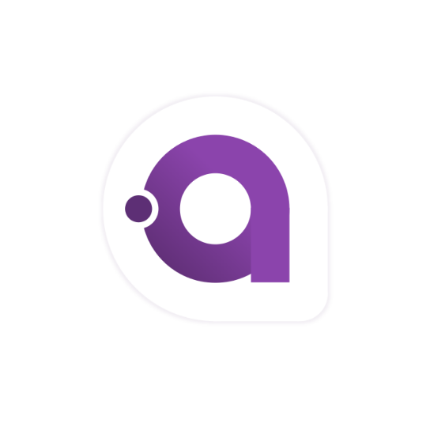

# Avalonia

My experimental fork of a Avalonia multi-platform framework. Draft/Sketch.

It's only my experiment to "inject" UWP platform onto Avalon... =)

*Caution*: used (for "forking") Avalonia (0.)5.1 is obsolete at now (5-7 years old). Don't try to use it for any production mode. It's only for your PoC "assembling" / RnD. 

## About
A multi-platform .NET UI framework. It can run on Windows, Linux, Mac OS X, iOS, Android, and... other platforms? ;)

## Screenshots/Mockups/Artwork

Desktop platforms:

<a href='https://www.youtube.com/watch?t=28&v=c_AB_XSILp0' target='_blank'><a/>

Mobile platforms:

<a href='https://www.youtube.com/watch?v=NJ9-hnmUbBM' target='_blank'><a/>

UWP "deals":

I added 2 new (dradt) projects:

src/Windows/Avalonia.UWP

samples/ControlCatalog.UWP

## NuGet

Avalonia is delivered as a NuGet package.
You can find the packages here: ([stable(ish)](https://www.nuget.org/packages/Avalonia/), [nightly](https://github.com/AvaloniaUI/Avalonia/wiki/Using-nightly-build-feed))

You can install the package like this:
`Install-Package Avalonia -Pre`

## Bleeding Edge Builds

Try out the latest build of Avalonia available for download here:
https://ci.appveyor.com/project/AvaloniaUI/Avalonia/branch/master/artifacts

Try out the ControlCatalog to give it a quick demo.

## Background

Avalonia is a multi-platform windowing toolkit - somewhat like WPF - that is intended to be multi-
platform. It supports XAML, lookless controls and a flexible styling system, and runs on Windows
using Direct2D and other operating systems using Gtk & Cairo.

## Current Status

Avalonia is now in alpha. What does "alpha" mean? Well, it means that it's now at a stage where you
can have a play and hopefully create simple applications. There's now a [Visual
Studio Extension](https://marketplace.visualstudio.com/items?itemName=AvaloniaTeam.AvaloniaforVisualStudio)
containing project and item templates that will help you get started, and
there's an initial complement of controls. There's still a lot missing, and you
*will* find bugs, and the API *will* change, but this represents the first time
where we've made it somewhat easy to have a play and experiment with the
framework.

## Documentation

As mentioned above, Avalonia is still in alpha and as such there's not much documentation yet. You can
take a look at the [getting started page](docs/tutorial/gettingstarted.md) for an
overview of how to get started but probably the best thing to do for now is to already know a little bit
about WPF/Silverlight/UWP/XAML and ask questions in our [Gitter room](https://gitter.im/AvaloniaUI/Avalonia).

There's also a high-level [architecture document](docs/spec/architecture.md) that is currently a little bit
out of date, and I've also started writing blog posts on Avalonia at http://grokys.github.io/.

Contributions are always welcome!

## Building and Using

See the [build instructions here](docs/guidelines/build.md)

## Contributing ##

Please read the [contribution guidelines](docs/guidelines/contributing.md) before submitting a pull request.

## References
- [Avalonia, a cross-platform UI framework for .NET](https://github.com/AvaloniaUI/Avalonia)
- [https://avaloniaui.net](avaloniaui.net)
- [pingzing's avalonia-uwp-fork](https://github.com/pingzing/avalonia-uwp-fork) 
- [Avalonia UWP tech tolk at Gitter](https://gitter.im/AvaloniaUI/Avalonia?at=59cd68ff614889d4754ff3c7)

## ..
AS IS. RnD only.

## .
[m][e] 2022
